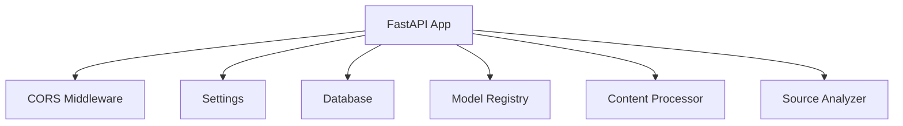
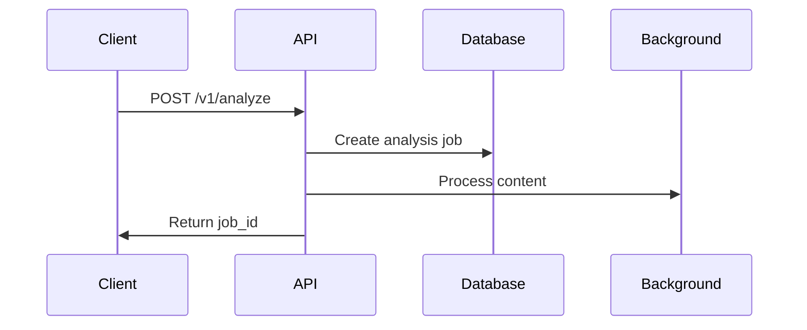

# OpenSentiment API Technical Documentation

## Overview
The `main.py` file implements a FastAPI-based REST API for sentiment and bias analysis. The application provides endpoints for content analysis, source credibility assessment, and model comparison.

## Core Components

### Initialization


### Lifecycle Events
- **Startup** (`startup_event`): Initializes database connections and loads models
- **Shutdown** (`shutdown_event`): Performs cleanup of database resources

## API Endpoints

### 1. Content Analysis
#### `POST /v1/analyze`

- **Input**: `AnalysisRequest` (text or URL)
- **Output**: `AnalysisResponse` with job ID
- **Authentication**: Required
- **Background Processing**: Yes

### 2. Analysis Results
#### `GET /v1/analysis/{job_id}`
- **Purpose**: Retrieve analysis results
- **Input**: Job ID string
- **Output**: `AnalysisResponse` with complete analysis
- **Authentication**: Required

### 3. Source Analysis
#### `GET /v1/source/{domain}`
- **Purpose**: Analyze source credibility and bias
- **Input**: Domain string
- **Output**: `SourceAnalysis`
- **Authentication**: Required

### 4. Model Comparison
#### `POST /v1/models/compare`
- **Purpose**: Compare analysis across different models
- **Input**: 
  - `AnalysisRequest`
  - List of model IDs
- **Output**: `ModelComparison`
- **Authentication**: Required

### 5. Model Listing
#### `GET /v1/models`
- **Purpose**: List available analysis models
- **Output**: List of model configurations
- **Authentication**: Required

## Error Handling
All endpoints implement:
- Comprehensive exception handling
- Logging of errors
- Appropriate HTTP status codes
- Detailed error messages

## Configuration
```python
Settings {
    host: str
    port: int
    debug_mode: bool
    # Additional configuration parameters
}
```

## Dependencies
- **FastAPI**: Web framework
- **Pydantic**: Data validation
- **uvicorn**: ASGI server
- **Custom Modules**:
  - `config`: Application settings
  - `models`: Model management
  - `database`: Data persistence
  - `auth`: Authentication
  - `processors`: Content processing
  - `schemas`: Data models

## Security Features
- Authentication required for all endpoints
- CORS middleware configuration
- User context through dependency injection

## Running the Application
The application can be started using:
```bash
python main.py
```
This will initialize the uvicorn server with configured host, port, and debug settings.
